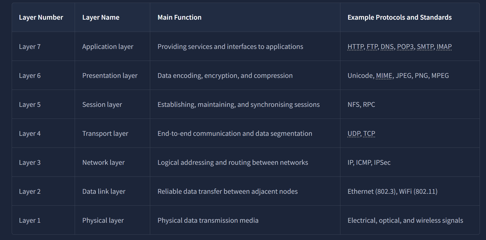
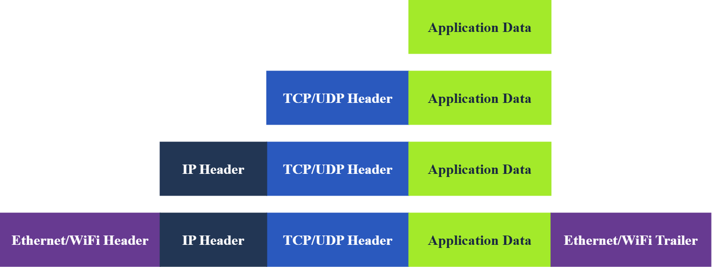

# Day 17- 31 july 2025

# Networking Concepts

## OSI Model
- The OSI (Open Systems Interconnection) model is a conceptual model developed by the International Organization for Standardization (ISO) that describes how communications should occur in a computer network.

1. Physical Layer 
2. Data Link Layer
3. Network Layer
4. Transport Layer
5. Session Layer
6. Presentation Layer
7. Application Layer

The numbering starts with the physical layer being layer 1, while the top layer, the application layer, is layer 7.

" Please Do Not Throw Spinach Pizza Away" acronyms to remember the layer's order.

### Layer 1: Physical Layer:
This layer deals with the physical connection between devices; this includes the medium, such as a wire, and the definition of the binary digits 0 and 1.

### Layer 2: Data Link Layer:
The data link layer, i.e., layer 2, represents the protocol that enables data transfer between nodes on the same network segment (devices). MAC is used here.

### Layer 3: Network Layer:
This layer is concerned with sending data between different networks. In more technical terms, the network layer handles logical addressing and routing, i.e., finding a path to transfer the network packets between the diverse networks. IP and VPNs role takes play here.

### Layer 4: Transport Layer
Layer 4, the transport layer, enables end-to-end communication between running applications on different hosts. 

### Layer 5: Session Layer:
The session layer is responsible for establishing, maintaining, and synchronising communication between applications running on different hosts. Establishing a session means initiating communication between applications and negotiating the necessary parameters for the session. Data synchronisation ensures that data is transmitted in the correct order and provides mechanisms for recovery in case of transmission failures.

Examples of the session layer are Network File System (NFS) and Remote Procedure Call (RPC).

### Layer 6: Presentation Layer:
The presentation layer ensures the data is delivered in a form the application layer can understand. Layer 6 handles data encoding, compression, and encryption. An example of encoding is character encoding, such as ASCII or Unicode.

### Layer 7: Application Layer:
The application layer provides network services directly to end-user applications. Your web browser would use the HTTP protocol to request a file, submit a form, or upload a file.

## TCP/IP Model

One of the strengths of this model is that it allows a network to continue to function as parts of it are out of service, for instance, due to a military attack. 

Application, Presentation, and Session Layers in the ISO OSI Model are expressed as the Application Layer in the TCP/IP Model.

## IP Addresses and Subnets
Every host on the network needs a unique identifier for other hosts to communicate with him. Without a unique identifier, the host cannot be found without ambiguity. When using the TCP/IP protocol suite, we need to assign an IP address for each device connected to the network.

So, what makes an IP address? An IP address comprises four octets, i.e., 32 bits. Being 8 bits, an octet allows us to represent a decimal number between 0 and 255.

192.168.1.0 is the network address, while 192.168.1.255 is the broadcast address. Sending to the broadcast address targets all the hosts on the network. 

### Private Addresses
We know what are pravite add and public add are. 

RFC 1918 defines the following three ranges of private IP addresses:

10.0.0.0 - 10.255.255.255 (10/8)
172.16.0.0 - 172.31.255.255 (172.16/12)
192.168.0.0 - 192.168.255.255 (192.168/16)

The /24 means that the leftmost 24 bits within the IP address do not change across the network

 For a private IP address to access the Internet, the router must have a public IP address and must support Network Address Translation (NAT).

Think this as houses in an isolated city. Where house can easily exchange mail with each other, but not with the outside world.

### Routing
A router is like your local post office.

In technical terms, a router forwards data packets to the proper network. Usually, a data packet passes through multiple routers before it reaches its final destination. The router functions at layer 3, inspecting the IP address and forwarding the packet to the best network (router) so the packet gets closer to its destination.

#### question
Which of the following IP addresses is not a valid IP address?

192.168.250.15
192.168.254.17
192.168.305.19
192.168.199.13

#### answer
192.168.305.19 Each octet must be between 0 and 255.

## UDP and TCP

We need protocols that would enable processes on networked hosts to communicate with each other.

### UDP:
UDP is a simple connectionless protocol that operates at the transport layer, i.e., layer 4. Being connectionless means that it does not need to establish a connection. UDP does not even provide a mechanism to know that the packet has been delivered.

There is no guarantee that the UDP packet has been received successfully.

### TCP:

TCP (Transmission Control Protocol) is a connection-oriented transport protocol. It uses various mechanisms to ensure reliable data delivery sent by the different processes on the networked hosts.

A TCP connection is established using what’s called a three-way handshake. Two flags are used: SYN (Synchronise) and ACK (Acknowledgment). The packets are sent as follows:

    SYN Packet: The client initiates the connection by sending a SYN packet to the server. This packet contains the client’s randomly chosen initial sequence number.
    SYN-ACK Packet: The server responds to the SYN packet with a SYN-ACK packet, which adds the initial sequence number randomly chosen by the server.
    ACK Packet: The three-way handshake is completed as the client sends an ACK packet to acknowledge the reception of the SYN-ACK packet.

#### question
What is at port 0?

#### Answer
Nothing, it Lets the OS handle port assignment securely. 

## Encapsulation
Encapsulation refers to the process of every layer adding a header (and sometimes a trailer) to the received unit of data and sending the “encapsulated” unit to the final layer. 

- Application data: It all starts when the user inputs the data they want to send into the application. For example, you write an email or an instant message and hit the send button. The application formats this data and starts sending it according to the application protocol used, using the layer below it, the transport layer.

- Transport protocol segment or datagram: The transport layer, such as TCP or UDP, adds the proper header information and creates the TCP segment (or UDP datagram). This segment is sent to the layer below it, the network layer.

- Network packet: The network layer, i.e. the Internet layer, adds an IP header to the received TCP segment or UDP datagram. Then, this IP packet is sent to the layer below it, the data link layer.

- Data link frame: The Ethernet or WiFi receives the IP packet and adds the proper header and trailer, creating a frame.

We start with application data. At the transport layer, we add a TCP or UDP header to create a TCP segment or UDP datagram. Again, at the network layer, we add the proper IP header to get an IP packet that can be routed over the Internet. Finally, we add the appropriate header and trailer to get a WiFi or Ethernet frame at the link layer.

## Telnet
The TELNET (Teletype Network) protocol is a network protocol for remote terminal connection. 

In simpler words, telnet, a TELNET client, allows you to connect to and communicate with a remote system and issue text commands.

Although initially it was used for remote administration, we can use telnet to connect to any server listening on a TCP port number.

On the target virtual machine, different services are running. We will experiment with three of them:
    Echo server: This server echoes everything you send it. By default, it listens on port 7.
    Daytime server: This server listens on port 13 by default and replies with the current day and time.
    Web (HTTP) server: This server listens on TCP port 80 by default and serves web pages.

echo and daytime servers are not safe but we are using vm so it is ok.

- to start a telnet write **`telnet <your ip add> <port no.>`** (remember the space between ip and port.).
- to end the connection with server use **`ctrl+]` to escape the telnet** and **`ctrl+c`(keyboard interpution) to forcefully end telnet.**

#### requesting a web server:
- `telnet <ip add> <port no.>`.
- It will ask you to write your request so e.g. **`GET / HTTP/1.1`** (REMEMBER THE SPACE). You have to *tell it where all the stuff goes* e.g. **`Host: telnet.thm`.** Then you have to **press enter twice.**

- you have ip add of a device but do not have the credentails. You can still request *unprotected webservers which are available on public server like port 80 or 443*.

#### Question
what is that 1.1?

#### Answer
HTTP/1.1 refers to version 1.1 of the Hypertext Transfer Protocol (HTTP).  Almost all servers support HTTP/1.1.and it is a Required Header now.