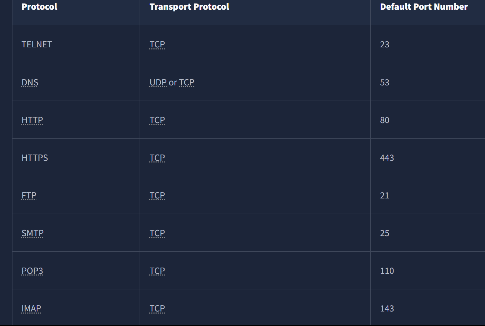

# DAY 19- 2nd AUGUST 2025

# Networking Core Protocols

## DNS: Remembering Addresses

Domain name system. We can't remember long ip addresses all the time so DNS. e.g. www.google.com.

DNS operates at the Application Layer.
DNS traffic uses UDP port 53 by default and TCP port 53 as a default fallback. 

There are 4 main types of records:
    - A record: The A (Address) record maps a hostname to one or more **IPv4 addresses.** For example, you can set example.com to resolve to 172.17.2.172.
    - AAAA Record: The AAAA record is similar to the A Record, but **it is for IPv6.**
    - CNAME Record: The CNAME (Canonical Name) record maps **a domain name to another domain name.** For example, www.example.com can be mapped to example.com or even to example.org.
    - MX Record: The MX (Mail Exchange) record **specifies the mail server responsible for handling emails for a domain.**

When you search for example.com in your browser, browser tries to resolve this by quering the DNS server for the A record.
However, when you try to send an email to test@example.com, the mail server would query the DNS server to find the MX record.

If you *want to look up the IP address of a domain from the command line,* you can use a tool such as **`nslookup <website's name>`.**

use `tshark -r dns-query.pcapng -Nn` to look up process taking palce.


## WHOIS

Whoever registers a domain name is granted the power to set the A, AAAA, and MX records, among other DNS records for the domain.

You can register any available domain name for one or more years. *You need to pay the annual fee, and you are required to provide accurate contact information as the registrant.*
**This information is part of the data available via WHOIS records and is available publicly.**

You can look up the WHOIS records of any registered domain name using one of the online services or via the **command-line tool `whois`**, available on Linux systems.
*A WHOIS record provides information about the entity that registered a domain name, including name, phone number, email, and address.*


## HTTP(S): Accessing the Web

Some of the commands or methods that your web browser commonly issues to the web server are:
    GET **retrieves data from a server**, such as an HTML file or an image.
    POST **allows us to submit new data to the server**, such as submitting a form or uploading a file.
    PUT is **used to create a new resource** on the server and to update and overwrite existing information.
    DELETE, as the name suggests, is used **to delete a specified file or resource on the server.**


HTTP and HTTPS commonly use TCP ports 80 and 443, respectively, and less commonly other ports such as 8080 and 8443.

IP you have ip address of a website instead of name it still works. Use wireshark(have not learned how to use it yet) to see what is going on. Like http request, etc. 
We used the telnet client to connect to the web server running on 10.201.20.199 at port 80. 
We had to send a couple of lines: GET / HTTP/1.1 and Host: anything to get the page we wanted. (On some servers, you might get the file without sending Host: anything.) You can use this method to access any page and not just the default page /. To get file.html, you would send GET /file.html HTTP/1.1, for instance (GET /file.html might work depending on the web server in use). 

This approach is efficient for troubleshooting as you would be “talking HTTP” with the server.


## FTP: Transferring Files
Unlike HTTP, which is designed to retrieve web pages, **File Transfer Protocol (FTP) is designed to transfer files.** As a result, *FTP is very efficient for file transfer, and when all conditions are equal, it can achieve higher speeds than HTTP.*
Example commands defined by the FTP protocol are:
    USER is used to input the username
    PASS is used to enter the password
    RETR (retrieve) is used to download a file from the FTP server to the client.
    STOR (store) is used to upload a file from the client to the FTP server.

FTP server listens on TCP port 21 by default; data transfer is conducted via another connection from the client to the server.

**to use FTP**:
    - type `ftp <ip address>` this will connect you to it.
    - It will ask your user name, they to login into the remote server. You have to know the credentials. 
    - It will ask for the password, if you know the server's cedential use it.
    - us `ls` this will list every file on that server.
    *- `type ascii` to switch to ascii mode as this is a text file. Only needed if transferring text files (use type binary for images/binaries).*
    - `get <filename>`allowed us to retrieve the file we want.
    - **`ftp> get file.txt -`  # Hyphen (-) outputs to terminal instead of saving, preview**


## SMTP: Sending Email

As with browsing the web and downloading files, sending email needs its own protocol. 
**Simple Mail Transfer Protocol (SMTP) defines how a mail client talks with a mail server and how a mail server talks with another.**

The analogy for the SMTP protocol is when you go to the local post office to send a package. You greet the employee, tell them where you want to send your package, and provide the sender’s information before handing them the package.

**Some commands used by mail clients for using SMTP:**
    HELO or EHLO: initiates an SMTP session
    MAIL FROM: specifies the sender’s email address
    RCPT: TO specifies the recipient’s email address
    DATA: indicates that the client will begin sending the content of the email message
    ".": is sent on a line by itself to indicate the end of the email message


- We use `telnet <ip add> <port i.e 25>` SMTP is **listening on port 25.**
- `HELO <client.thm>` write your own client. Like email.com.
- `MAIL FROM: <user@client.thm>` your email add.
- `RCPT: <stratoge@server.thm>` to whom?
- `DATA` You enter your context. *AND WHEN YOU ARE DONE TYPE `.` IN ANOTHER LINE AND `ENTER`.
- 250 ok  is success protocol for smtp like how thm will be 250 ok for my career.


Obviously, sending an email using telnet is quite cumbersome; however, it helps you better understand the commands that your email client issues under the hood.

## POP3: Receiving Email

You’ve received an email and want to download it to your local mail client. The Post Office Protocol version 3 (POP3) is designed to allow the client to communicate with a mail server and retrieve email messages.

**An email client sends its messages by relying on SMTP and retrieves them using POP3**

USER <username> identifies the user
PASS <password> provides the user’s password
STAT requests the number of messages and total size
LIST lists all messages and their sizes
RETR <message_number> retrieves the specified message
DELE <message_number> marks a message for deletion
QUIT ends the POP3 session applying changes, such as deletions

- **Since the POP3 server listens on TCP port 110 by default, the command to connect to the TELNET port is `telnet <ip add> <port i.e. 110>.`**


```

user@TryHackMe$ telnet 10.201.20.199 110
Trying 10.201.20.199...
Connected to 10.201.20.199.
Escape character is '^]'.
+OK [XCLIENT] Dovecot (Ubuntu) ready.
AUTH
+OK
PLAIN
.
USER strategos -> login username
+OK
PASS -> password
+OK Logged in.
STAT -> command to requests the number of messages and total size
+OK 3 1264
LIST -> lists all messages and their sizes
+OK 3 messages:
1 407
2 412
3 445
.
RETR 3 -> retrive with the index number of the message you want
+OK 445 octets
Return-path: <user@client.thm>
Envelope-to: strategos@server.thm
Delivery-date: Thu, 27 Jun 2024 16:19:35 +0000
Received: from [10.11.81.126] (helo=client.thm)
        by example.thm with smtp (Exim 4.95)
        (envelope-from <user@client.thm>)
        id 1sMrpq-0001Ah-UT
        for strategos@server.thm;
        Thu, 27 Jun 2024 16:19:35 +0000
From: user@client.thm
To: strategos@server.thm
Subject: Telnet email

Hello. I am using telnet to send you an email!
.
QUIT -> to quit.
+OK Logging out.
Connection closed by foreign host.

```

This is offline thing and for 1 device since it downloads the mails and then that mail vanishes from the list.

#### Question
why use `stat` on pop3 if you can use `list` and it does the same thing?

#### Answer

STAT Returns total emails + total size (in bytes) in the mailbox. **Quick mailbox summary (e.g., "You have 5 emails, 120KB total")**. Lightweight (1-line response).

LIST Returns each email’s ID + size (or details for a specific ID if provided).	**Inspecting individual emails (e.g., "Email #1 is 2KB, #2 is 5KB...").** Heavier (lists all emails).


**Someone capturing the network packets would be able to intercept the exchanged traffic. Using wireshark, It is also clear that someone capturing the traffic can read the passwords.**


## IMAP: Synchronizing Email

You need a protocol that allows synchronization of messages instead of deleting a message after retrieving it. One solution to maintaining a synchronized mailbox across multiple devices is Internet Message Access Protocol (IMAP).

IMAP allows synchronizing read, moved, and deleted messages. **You use Gmail, Outlook, or iCloud (they’re designed for IMAP).**

IMAP tends to use more storage as email is kept on the server and synchronized across the email clients.

 We list a few examples below:
    LOGIN <username> <password> authenticates the user
    SELECT <mailbox> selects the mailbox folder to work with
    FETCH <mail_number> <data_item_name> Example fetch 3 body[] to fetch message number 3, header and body.
    MOVE <sequence_set> <mailbox> moves the specified messages to another mailbox
    COPY <sequence_set> <data_item_name> copies the specified messages to another mailbox
    LOGOUT logs out

**the IMAP server listens on TCP port 143.**

## IMPORTANT PORTS:


