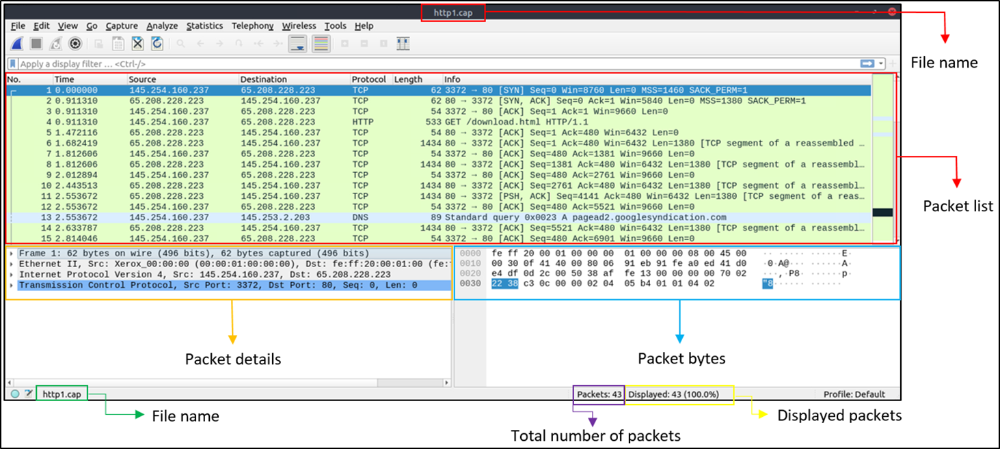

# Day 21- 4th august 2025 

# Wireshark: The Basics

Wireshark is an open-source, cross-platform network packet analyser tool capable of sniffing and investigating live traffic and inspecting packet captures (PCAP). It is commonly used as one of the best packet analysis tools.

## Tool Overview

### Use Cases

Wireshark is one of the most potent traffic analyser tools available in the wild.

There are multiple purposes for its use:
    - **Detecting and troubleshooting network problems**, such as network load failure points and congestion.
    - **Detecting security anomalies,** such as rogue hosts, abnormal port usage, and suspicious traffic.
    - **Investigating and learning protocol details,** such as response codes and payload data. 

Note: **Wireshark is not an Intrusion Detection System (IDS). It only allows analysts to discover and investigate the packets in depth. It also doesn't modify packets; it reads them.** Hence, detecting any anomaly or network problem highly relies on the analyst's knowledge and investigation skills.

### GUI and Data:

### Loading PCAP Files

Note that you can also use the "File" menu, dragging and dropping the file, or double-clicking on the file to load a pcap.

- Packet List Pane
    Summary of each packet (source and destination addresses, protocol, and packet info). You can click on the list to choose a packet for further investigation. Once you select a packet, the details will appear in the other panels.

- Packet Details Pane
    Detailed protocol breakdown of the selected packet.

- Packet Bytes Pane
    Hex and decoded ASCII representation of the selected packet. It highlights the packet field depending on the clicked section in the details pane. 

### Colouring Packets

Along with quick packet information, Wireshark also colour packets in order of different conditions and the protocol to spot anomalies and protocols in captures quickly

### Traffic Sniffing

**Traffic sniffing in Wireshark refers to the process of capturing and analyzing network packets as they travel across a network.**

You can use the blue "shark button" to start network sniffing (capturing traffic), the red button will stop the sniffing, and the green button will restart the sniffing process. **The status bar will also provide the used sniffing interface and the number of collected packets.**

### Merge PCAP Files

**Wireshark can combine two pcap files into one single file.** You can use the *"File --> Merge" menu path to merge* a pcap with the processed one. When you choose the second file, Wireshark will show the total number of packets in the selected file. *Once you click "open", it will merge the existing pcap file with the chosen one and create a new pcap file.* **Note that you need to save the "merged" pcap file before working on it.**

### View File Details

when working with multiple pcap files, **sometimes you will need to know and recall the file details (File hash, capture time, capture file comments, interface and statistics) to identify the file, classify and prioritise it.** You can view the details by following *"Statistics --> Capture File Properties"* or by clicking the "pcap icon located on the left bottom" of the window.

**YOU WILL FIND EVERY DETAILS HERE!!!**

## Packet Dissection

### Packet Dissection

**Packet dissection is also known as protocol dissection, which investigates packet details by decoding available protocols and fields.** 

### Packet Details

You can click on a packet in the packet list pane to open its details (double-click will open details in a new window). *Packets consist of 5 to 7 layers based on the OSI model.* We will go over all of them in an HTTP packet.

Each time you click a detail, it will highlight the corresponding part in the packet bytes pane.

The Frame (Layer 1): This will show you what frame/packet you are looking at and details specific to the Physical layer of the OSI model.

Source [MAC] (Layer 2): This will show you the source and destination MAC Addresses; from the Data Link layer of the OSI model.

Source [IP] (Layer 3): This will show you the source and destination IPv4 Addresses; from the Network layer of the OSI model.

Protocol (Layer 4): This will show you details of the protocol used (UDP/TCP) and source and destination ports; from the Transport layer of the OSI model.

Protocol Errors: This continuation of the 4th layer shows specific segments from TCP that needed to be reassembled.

Application Protocol (Layer 5): This will show details specific to the protocol used, such as HTTP, FTP,  and SMB. From the Application layer of the OSI model.

Application Data: This extension of the 5th layer can show the application-specific data.

In networking and packet analysis (like in Wireshark), **the payload refers to the actual data being carried by a packet, excluding headers and metadata.**

An ETag (Entity Tag) is an HTTP header used for:
    Cache validation (to check if a resource has changed).
    Conditional requests (to avoid re-downloading unchanged data).

**It acts like a fingerprint for a web resource (e.g., HTML file, image, API response).**

## Packet Navigation

### Packet Numbers

**Wireshark calculates the number of investigated packets and assigns a unique number for each packet.** This helps the analysis process for big captures and makes it easy to go back to a specific point of an event. 

### Go to Packet

**Packet numbers do not only help to count the total number of packets or make it easier to find/investigate specific packets.**

You can use the "Go" menu and toolbar to view specific packets.
Jumps directly to a packet by number.

### Find Packets

Apart from packet number, **Wireshark can find packets by packet content.** You can use the "Edit --> Find Packet" menu to make a search inside the packets for a particular event of interest. This helps analysts and administrators to find specific intrusion patterns or failure traces.

There are two crucial points in finding packets.
    - **The first is knowing the input type.** This functionality accepts four types of inputs (Display filter, Hex, String and Regex). *String and regex searches are the most commonly used search types.* Searches are case insensitive, but you can *set the case sensitivity in your search by clicking the radio button.*
    - **The second point is choosing the search field.** *You can conduct searches in the three panes (packet list, packet details, and packet bytes), and it is important to know the available information in each pane to find the event of interest.* For example, if you try to find the information available in the packet details pane and conduct the search in the packet list pane, Wireshark won't find it even if it exists.

Searches for packets matching specific criteria (e.g., text, hex, or protocol fields).

### Mark Packets

You can find/point to a specific packet for further investigation by marking it.
You can use the "Edit" or the "right-click" menu to mark/unmark packets.

### Packet Comments

**You can add comments for particular packets that will help the further investigation or remind and point out important/suspicious points for other layer analysts.**
 Unlike packet marking, the comments can stay within the capture file until the operator removes them.

### Export Packets

It is necessary to separate specific packages from the file and dig deeper to resolve an incident. This functionality helps analysts share the only suspicious packages (decided scope). 

Thus redundant information is not included in the analysis process.

The "Export Packets" feature in Wireshark allows you to:
    Save filtered packets to a new file (e.g., .pcap, .pcapng, .csv).
    Extract specific data (e.g., HTTP objects, VoIP calls, or malware traffic).
    Share subsets of traffic for analysis or reporting.

### Export Objects (Files)

Wireshark can extract files transferred through the wire. For a security analyst, it is vital to discover shared files and save them for further investigation. Exporting objects are available only for selected protocol's streams (DICOM, HTTP, IMF, SMB and TFTP). 
**This is better than that find feature**

### Time Display Format

Wireshark lists the packets as they are captured, so investigating **the default flow is not always the best option.**

*the common usage is using the UTC Time Display Format for a better view.*

### Expert Info

Wireshark also detects specific states of protocols to help analysts easily spot possible anomalies and problems.

**Note that these are only suggestions, and there is always a chance of having false positives/negatives.**

- chat-blue: information on usual workflow
- note-cyan: Notable events like application error codes.
- warn-yellow: Warnings like unusual error codes or problem statements.
- error-red: Problems like malformed packets.

Checksum-Checksum errors:Deprecated-Deprecated protocol usage.
Comment-Packet comment detection:Malformed-Malformed packet detection.

## Packet Filtering

### Packet Filtering

Wireshark has two types of filtering approaches: capture and display filters.

Capture filters are used for "capturing" only the packets valid for the used filter.
Display filters are used for "viewing" the packets valid for the used filter.

there are two different ways to filter traffic and remove the noise from the capture file. The first one uses queries, and the second uses the right-click menu. Wireshark provides a powerful GUI, and there is a golden rule for analysts who don't want to write queries for basic tasks: "If you can click on it, you can filter and copy it".

### Conversation Filter
suppose you want to investigate a specific packet number and all linked packets by focusing on IP addresses and port numbers. In that case, the "Conversation Filter" option helps you view only the related packets and hide the rest of the packets easily.

### Colorise conversation
highlights the linked packets without applying a display filter and decreasing the number of viewed packets.

### Prepare as Filter 

unlike the previous one, this model doesn't apply the filters after the choice. It adds the required query to the pane and waits for the execution command (enter) or another chosen filtering option by using the ".. and/or.." from the "right-click menu".

### Apply as column

By default, the packet list pane provides basic information about each packet.
This function helps analysts examine the appearance of a specific value/field across the available packets in the capture file.

### Follow Stream

Wireshark displays everything in packet portion size. However, it is possible to reconstruct the streams and view the raw traffic as it is presented at the application level. *Following the protocol, streams help analysts recreate the application-level data and understand the event of interest.* **It is also possible to view the unencrypted protocol data like usernames, passwords and other transferred data.**

Streams are shown in a separate dialogue box; packets originating from the server are highlighted with blue, and those originating from the client are highlighted with red.
