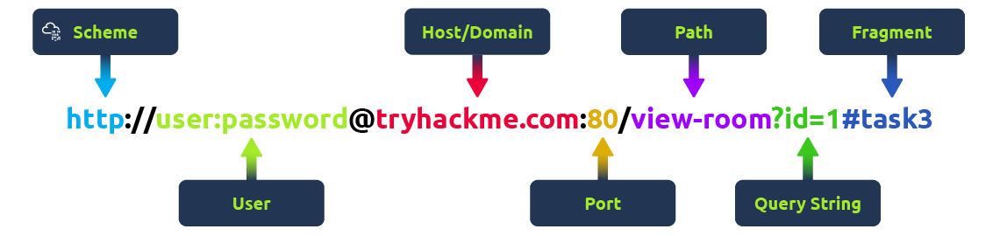
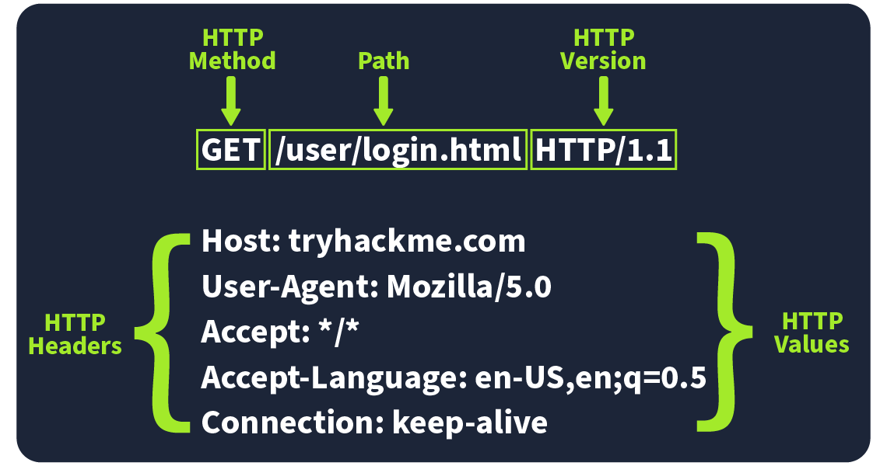
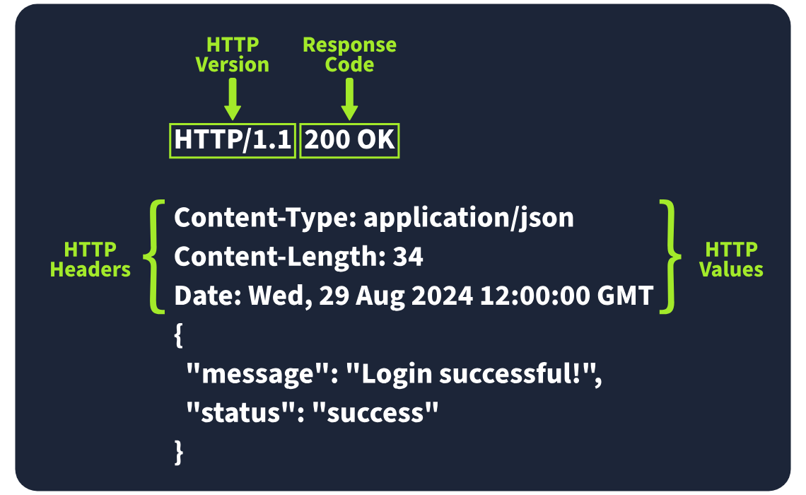

# Day 32- 14th august 2025

# Web Application Basics

Learning Objectives:

Understand what a web application is and how it runs in a web browser.
Break down the components of a URL and see how it helps access web resources.
Learn how HTTP requests and responses work.
Get familiar with the different types of HTTP request methods.
Understand what different HTTP response codes mean.
Check out how HTTP headers work and why they matter for security.

## Web Application Overview

Consider an analogy of a web application as a planet. 

Astronauts travel to the planet to explore its surface, similar to how someone uses a web browser to explore or browse a web application.

There are many layers to this process.

### Front end

The Front End can be considered similar to the surface of the planet, the parts that an astronaut can see and interact with based on the laws of nature. 

**HTML (Hypertext Markup Language)** is a foundational aspect of web applications. 

It is a set of instructions or code that instructs a web browser on what to display and how to display it. 

It could be compared to simple organisms living on the planet; these organisms have DNA, which is the instructions for how simple organisms are put together.

**CSS (Cascading Style Sheets)** in web applications describes a standard appearance, such as certain colours, types of text, and layouts.
 
Continuing the analogy with DNA, these could be compared to the parts of DNA that describe the colour, shape, size, and texture of the simple organism.

**JS (JavaScript)** is part of a web application front end that enables more complex activity in the web browser. 

Whereas HTML can be considered a simple set of instructions on what to display, JavaScript is a more advanced set of instructions that allows choices and decisions to be made on what to display. 

In the planet analogy, JavaScript can be considered the brain of an advanced organism, which allows decisions to be made based on what and how something interacts with it.

### Back End

The Back End of a web application is things you don’t see within a web browser but are important for the web application to work. 

On a planet, these are the non-visual things: the structures that keep a building standing, the air, and the gravity that keeps feet on the ground.

A **Database** is where information can be stored, modified, and retrieved. 

A web application may want to store and retrieve information about a visitor's preferences on what to show or not; this would be stored in a database. 

A planet may have more advanced inhabitants who store information about locations in maps, write notes in a diary or put books in a library and files in a filing cabinet.

There are many other **Infrastructure** components underpinning Web Applications, such as web servers, application servers, storage, various networking devices, and other software that support the web application. 

On a planet, these are the roads that are present, the cars that run on those roads, the fuel that powers the cars.

**WAF (Web Application Firewall)** is an optional component for web applications. **The Ozone layer of web.**

It helps filter out dangerous requests away from the Web Server and provides an element of protection. 

This could be considered similar to how a planet's atmosphere can protect inhabitants from harmful UV rays.

**Front End components focus on the experience.**

**Back End enable the web application to function.**


## Uniform Resource Locator

This is the web address infamously URL.



**Scheme**: The scheme is the protocol used to access the website.

**User**: Some URLs can include a user’s login details (usually a username) for sites that require authentication. 
However, it’s **rare nowadays** because putting login details in the URL isn’t very safe.

**Host/Domain**: The host or domain is the most important part of the URL because it tells you which website you’re accessing. There will be some domains that look same like the og domain but will have a very small change in it, this is called **typosquatting.** These fake domains are often used in **phishing** attacks to trick people into giving up sensitive info.

**Port**: The port number helps direct your browser to the right service on the web server.

**Path**: The path points to the specific file or page on the server that you’re trying to access. 

**Query String**: starts with a question mark (?). It’s often used for things like search terms or form inputs. This is like how we use `search -f file*` but for webserver. it’s important to handle them securely to prevent attacks like injections.

**Fragment**: The fragment starts with a hash symbol (#) and helps point to a specific section of a webpage—like jumping directly to a particular heading or table.

## HTTP Messages

HTTP messages are packets of data exchanged between a user (the client) and the web server.

There are two types of HTTP messages:
**HTTP Requests:** Sent by the user to trigger actions on the web application.
**HTTP Responses:** Sent by the server in response to the user’s request.


### Start Line

The start line is like the **introduction** of the message. 
It tells you what kind of message is being sent—whether it's a request from the user or a response from the server.

### Headers

Headers are made up of key-value pairs that provide **extra information** about the HTTP message. 
These headers cover all sorts of things, like **security, content types**, and more, making sure everything goes smoothly in the communication.

### Empty line

The empty line is a little divider that **separates the header from the body.**
It’s essential because it shows where the headers stop and where the actual content of the message begins.

### Body

The body is where the actual data is stored. 
In a request, the body might include data the user wants to send to the server (like form data). 
In a response, it’s where the server puts the content that the user requested (like a webpage or API data).


## HTTP Request: Request Line and Methods

HTTP requests are often the first point of contact between the user and the web server.




### Request Line

the first part of an HTTP request and tells the server what kind of request it’s dealing with. 

*It has three main parts: the HTTP method, the URL path, and the HTTP version.*

**Example**: METHOD /path HTTP/version


### HTTP Methods

tells the server what action the user wants to perform on the resource identified by the URL path. LIKE:

**GET**: Used to fetch data from the server without making any changes.

**POST**: Sends data to the server, usually to create or update something. ALWAYS sanitize it.

**PUT**: Replaces or updates something on the server. 

**DELETE**: Removes something from the server.

**PATCH**: Updates part of a resource.

**HEAD**: Works like GET but **only retrieves headers, not the full content.**
*It’s handy for checking metadata without downloading the full response.*

**OPTIONS**: Tells you what **methods are available** for a specific resource, helping clients understand what they can do with the server.

**TRACE**: It shows which **methods are allowed, often for debugging**.
Many servers disable it for security reasons.

**CONNECT**: Used to **create a secure connection**, like for HTTPS.
It’s not as common but is critical for encrypted communication.


### URL Path

The URL path tells the server where to find the resource the user is asking for.

### HTTP Version

protocol version used to communicate between the client and server.
Although HTTP/2 and HTTP/3 offer better speed and security, many systems still use HTTP/1.1 because it’s well-supported and works with most existing setups.

## HTTP Request: Headers and Body

### Request Headers
Request Headers allow extra information to be conveyed to the web server about the request.

**Host**: e.g. Host: tryhackme.com. Specifies the name of the web server the request is for.

**User-Agent**: User-Agent: Mozilla/5.0. Shares information about the web browser the request is coming from.

**Referer**: Referer: https://www.google.com/. Indicates the URL from which the request came from.

**Cookie:** Cookie: user_type=student; room=introtowebapplication; room_status=in_progress.
Information the web server previously asked the web browser to store is held in cookies.

**Content-Type:** Content-Type: application/json. Describes what type or format of data is in the request.


### Request Body

The formatting of the data can take many forms, but some common ones are URL Encoded, Form Data, JSON, or XML.

**URL Encoded (application/x-www-form-urlencoded):**

A format where data is structured in pairs of key and value where (key=value).

Multiple pairs are separated by an (&) symbol, such as key1=value1&key2=value2. Special characters are percent-encoded.

e.g. 
```

POST /profile HTTP/1.1
Host: tryhackme.com
User-Agent: Mozilla/5.0
Content-Type: application/x-www-form-urlencoded
Content-Length: 33

name=Aleksandra&age=27&country=US

```

**Form Data (multipart/form-data):**

Allows multiple data blocks to be sent where **each block is separated by a boundary string.**
The boundary string is the defined header of the request itself. 
This type of formatting can be used to send **binary data**, such as when uploading files or images to a web server.

E.G:
```

POST /upload HTTP/1.1
Host: tryhackme.com
User-Agent: Mozilla/5.0
Content-Type: multipart/form-data; boundary=----WebKitFormBoundary7MA4YWxkTrZu0gW

----WebKitFormBoundary7MA4YWxkTrZu0gW
Content-Disposition: form-data; name="username"

aleksandra
----WebKitFormBoundary7MA4YWxkTrZu0gW
Content-Disposition: form-data; name="profile_pic"; filename="aleksandra.jpg"
Content-Type: image/jpeg

[Binary Data Here representing the image]
----WebKitFormBoundary7MA4YWxkTrZu0gW--

```

**JSON (application/json)**:

In this format, the data can be sent using the **JSON (JavaScript Object Notation) structure.**

Data is formatted in pairs of **name : value**. Multiple pairs are separated by commas, all contained within curly braces { }.

E.g.:

```

POST /api/user HTTP/1.1
Host: tryhackme.com
User-Agent: Mozilla/5.0
Content-Type: application/json
Content-Length: 62

{
    "name": "Aleksandra",
    "age": 27,
    "country": "US"
}

```

**XML (application/xml)**:

Data is structured inside labels called tags, which have an opening and closing. 
These labels can be nested within each other.

```

POST /api/user HTTP/1.1
Host: tryhackme.com
User-Agent: Mozilla/5.0
Content-Type: application/xml
Content-Length: 124

<user>
    <name>Aleksandra</name>
    <age>27</age>
    <country>US</country>
</user>

```

## HTTP Response: Status Line and Status Codes

Responses include a status code and a short explanation (called the **Reason Phrase**) that gives insight into how the server handled your request.

### Status Line

The first line in every HTTP response is called the Status Line. It gives you three key pieces of info:

HTTP Version: This tells you which version of HTTP is being used.
Status Code: A three-digit number showing the outcome of your request.
Reason Phrase: A short message explaining the status code in human-readable terms.


### Status Codes and Reason Phrases

**Informational Responses (100-199).**
These codes mean the server has received part of the request and is waiting for the rest. It’s a "keep going" signal.

**Successful Responses (200-299).**
These codes mean everything worked as expected. The server processed the request and sent back the requested data.

**Redirection Messages (300-399).**
These codes tell you that the resource you requested has moved to a different location, usually providing the new URL.

**Client Error Responses (400-499).**
These codes indicate a problem with the request. Maybe the URL is wrong, or you’re missing some required info, like authentication.

**Server Error Responses (500-599).**
These codes mean the server encountered an error while trying to fulfil the request. These are usually server-side issues and not the client’s fault.


### Common Status Codes

**100 (Continue).**
The server got the first part of the request and is ready for the rest.

**200 (OK).**
The request was successful, and the server is sending back the requested resource.

**301 (Moved Permanently).**
The resource you’re requesting has been permanently moved to a new URL. Use the new URL from now on.

**404 (Not Found).**
The server couldn’t find the resource at the given URL. Double-check that you’ve got the right address.

**500 (Internal Server Error).**
Something went wrong on the server’s end, and it couldn’t process your request.


## HTTP Response: Headers and Body

### Response Headers

This is the response that we get for our request.
Key headers like Content-Type, Content-Length, and Date give us important details about the response the server sends back.



### Required Response Headers
some are follow.

**Date:**
Example: Date: Fri, 23 Aug 2024 10:43:21 GMT
This header shows the exact date and time when the response was generated by the server.

**Content-Type:**
Example: Content-Type: text/html; charset=utf-8
It tells the client what kind of content it’s getting, *like whether it’s HTML, JSON, or something else.* It also includes the character set (like UTF-8) to help the browser display it properly.

**Server:**
Example: Server: nginx
This header shows what kind of *server software is handling the request.* It’s good for debugging, but it can also reveal server information that might be useful for attackers, so many people remove or obscure this one.


### Other Common Response Headers

**Set-Cookie:**
Example: Set-Cookie: sessionId=38af1337es7a8
This one sends cookies from the server to the client, which the client then stores and sends back with future requests. To keep things secure, make sure cookies are set with the **HttpOnly flag** (so they can’t be accessed by JavaScript) and the **Secure flag** (so they’re only sent over HTTPS).

**Cache-Control:**
Example: Cache-Control: max-age=600
This header tells the client how long it can cache the response before checking with the server again. It can also prevent sensitive info from being cached if needed (using no-cache).

**Location:**
Example: Location: /index.html
*This one’s used in redirection (3xx) responses.* It tells the client where to go next if the resource has moved. If users can modify this header during requests, be careful to validate and sanitise it—otherwise, you could end up with open redirect vulnerabilities, where attackers can redirect users to harmful sites.


## Security Headers

providing mitigations against attacks like Cross-Site Scripting (XSS), clickjacking, and others.

Some security headers.:

Content-Security-Policy (CSP).
Strict-Transport-Security (HSTS).
X-Content-Type-Options.
Referrer-Policy.

You can check a website's security header using [securityheaders](https://securityheaders.com/).

### Content-Security-Policy (CSP)

A CSP header is an additional security layer that can help mitigate against common attacks like Cross-Site Scripting (XSS). 

Malicious code could be hosted on a separate website or domain and **injected into the vulnerable website.**


Looking at an example CSP header:

`Content-Security-Policy: default-src 'self'; script-src 'self' https://cdn.tryhackme.com; style-src 'self'`

We see the use of:

**default-src**
- which specifies the default policy of self, which means *only the current website.*

**script-src**
- which specifics the policy for *where scripts can be loaded from*, which is self along with scripts hosted on https://cdn.tryhackme.com.

**style-src**
- which specifies the policy for *where style CSS style sheets can be loaded* from the current website (self).


### Strict-Transport-Security (HSTS)

The HSTS header *ensures that web browsers will always connect over HTTPS*. Let's look at an example of HSTS:

` Strict-Transport-Security: max-age=63072000; includeSubDomains; preload `

Here’s a breakdown of the example HSTS header by directive:

**max-age**
- This is the *expiry time in seconds* for this setting.

**includeSubDomains**
- An optional setting that instructs the browser to also *apply this setting to all subdomains.*

**preload**
- This optional setting allows the website to be *included in preload lists*. Browsers can use preload lists to enforce HSTS before even having their first visit to a website.


### X-Content-Type-Options

The X-Content-Type-Options header can be used to **instruct browsers not to guess the MIME time of a resource** but only use the Content-Type header. Here’s an example:

`X-Content-Type-Options: nosniff`

Here’s a breakdown of the X-Content-Type-Options header by directives:

**nosniff**
- This directive instructs the browser *not to sniff or guess the MIME type.*


### Referrer-Policy

This header *controls the amount of information sent to the destination web server when a user is redirected from the source web server, such as when they click a hyperlink.* The header is available to allow a web administrator to control what information is shared.  Here are some examples of Referrer-Policy:

Referrer-Policy: no-referrer
Referrer-Policy: same-origin
Referrer-Policy: strict-origin
Referrer-Policy: strict-origin-when-cross-origin
Here’s a breakdown of the Referrer-Policy header by directives:

**no-referrer**
- This completely *disables any information* being sent about the referrer.

**same-origin**
- This policy will *only send referrer information when the destination is part of the same origin.* This is helpful when you want referrer information passed when *hyperlinks are within the same website* but not outside to external websites.

**strict-origin**
- This policy *only sends the referrer as the origin when the protocol stays the same.* So, a referrer is sent when an HTTPS connection goes to another HTTPS connection.

**strict-origin-when-cross-origin**
- This is similar to strict-origin except for same-origin requests, *where it sends the full URL path in the origin header.*
